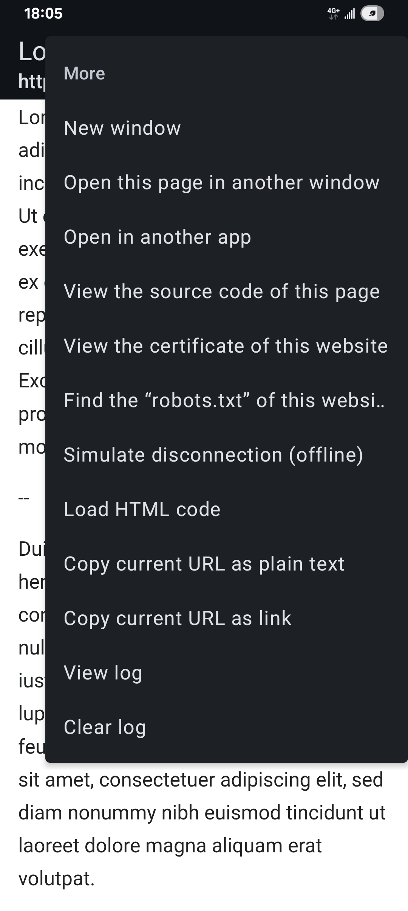
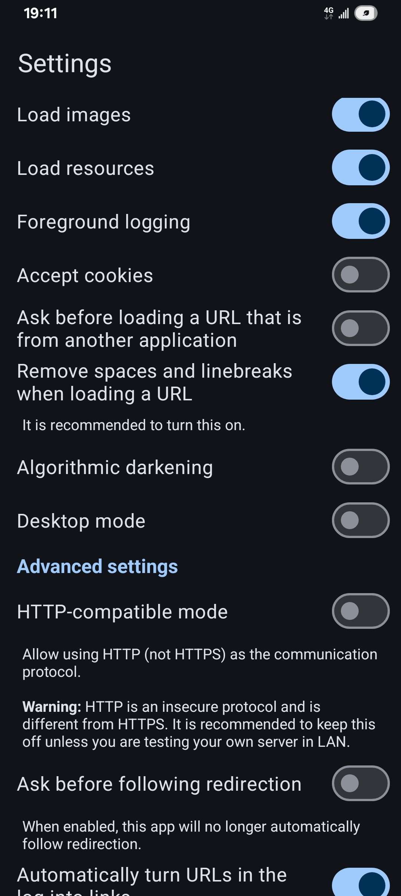
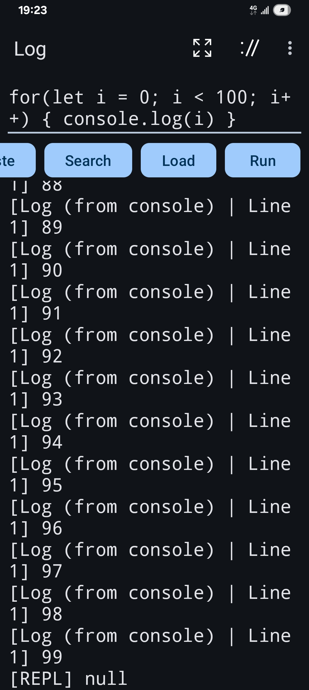
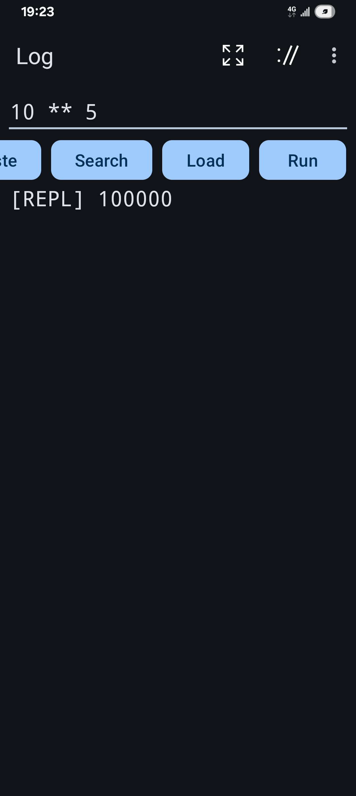
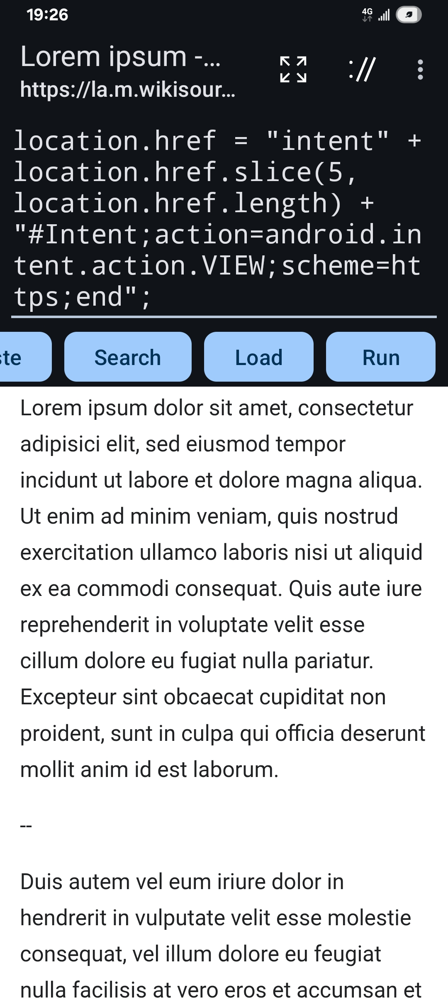

# Fundamental Browser

Fundamental Browser is a basic browser designed for running on Android. It is based on `WebView` and is intended to be developer-friendly.

Although not originally designed for, it can also be used as a JavaScript interpreter (works offline), generalized (and programmable) intent sender and activity launcher.

When used as a JavaScript interpreter, it can even work on platform API level 29 and above. (i.e. not subject to the W^X restriction, not at all, or at least not in technical aspects.)

However, the functionality of this app will not exceed what it should have as a browser with built-in developer tools. (It is... was common for browsers to have a JavaScript console, wasn't it?)

### Screenshots

### Features to be implemented

A developer-friendly browser should: (A checked box means implemented or already supported.)

- [x] Provide a field for editing URL

    - [x] The field itself should be large enough and should allow multiline editing.

    - [x] Can be closed or collapsed, so that the user can focus on the content.

    - [x] Should use a monospace font.

    - [x] The text size should be large enough.

    - [x] The URL should be displayed as-is.

- [ ] Customizable headers

- [x] Support desktop mode (on mobile).

- [x] Selectable or customizable locales (for the content rather than UI; implemented and tested)

- [x] Support searching in content.

    - [x] Support searching in the source code of a webpage.

- [x] Log everything so that nothing is secretly down- or up-loaded.

    - [x] The log is searchable.

- [ ] Display cookies.

- [x] Support `view-source:`. (Supported through framework)

- [x] <strike>Support `javascript:`</strike>. (Supported through framework, but considered deprecated now in this app.)

**The following features are not planned and thus will not be implemented in near future:**

- [ ] Ad-blocking

- [ ] Anti-tracking

- [ ] Bookmarks

- [ ] History

- [ ] PDF viewer

### Other features

#### Separated buttons for searching and URL loading

To make the search button usable, the 'Search URL' must be set. The search button is not the same as the 'Load' button, which loads a page of a given URL but will not do search, while the search button will not load a URL but... search for it. Such strict distinguishment between tasks is supposed to be helpful to prevent accidental URL loading and to allow the user to search for a domain-name-like or URL-like string.

As a desirable side effect, this browser will not automatically try to search for a string that looks like a URL/URI, unless explicitly asked by the user (by clicking the "search" button). When you use the "load" button, you will either successfully load a URL or fail to load it (if the website does not exist or the scheme is forbidden), but not search for it (unless you confirm to do so). And you are generally allowed to directly load `data:` or `view-source:` URIs (but only manually), as long as you write them correctly.

#### Console and REPL

To use the console and REPL features, input some code (should normally be JS code) in the URL field and then use the 'Run' button (enabled in settings) to execute it.

The support for `javascript:` scheme in this app is considered deprecated since Mar. 2025, and now the recommended way to run code in this app is to use the 'Run' button.

#### Generalized intent sender and activity launcher

See <a href="#Details">details</a> for more information about this usage.

### Note

* Since this app allows multiline editing, the 'Load' and 'Search' buttons (but not the 'Run' button) will by default replace newline characters in the URL field with spaces, or encode them as `%20` (meaning space).

* This app has no so-called 'History' feature. It instead has a log that logs everything including data and images. Some of the URLs in the log will be rendered clickable by default, and when you click one of them, it will be opened in this app. When you close the app, the log will be cleared, and therefore, the information in the log will not be preserved. The internal history of the browser is also supposed to be cleared and not be preserved once you close the app. There is no any mechanism implemented to preserve the history for this app, nor is any such feature planned to be implemented. If you want to preserve the history, just manually make a copy of the log in the form of plain text or rich text. When copied as rich text, the URLs rendered as links are supposed to still work outside this app, but will instead be opened in your default browser when clicked.

* To keep things simple, new windows are implemented in this app as new tasks/activities. Using more than one window may consume a lot of system resources due to this reason. Hence, new windows are not created automatically in most cases.

* For security concerns, JavaScript is automatically disabled by default when opening a URL from within another application. This can be changed in settings. In addition, this app will not load a URL from an intent unless its scheme is `http:` or `https:`. The latter rule is not enforced for URLs from a webpage or for URL/URIs loaded manually by the user.

* This browser supports HTTP (the non-secure protocol that is similar to but different from HTTPS), but it is disabled by default, meaning this app will block (non-HTTPS) HTTP requests unless you enable HTTP in settings. HTTPS is used normally and is not subject to this rule. The reason for this application to support (non-secure) HTTP is to allow debugging custom servers in LAN. It's not for general use. Don't enable it unless you really need it.

* This app currently cannot be used to open PDF URLs. Such support is not planned and is unlikely to be implemented in the future, because PDF files are, as far as I know, not commonly used in web development nor in webcrawling.

* Remember to (or not to) update your "System WebView." It may affect the behavior of this application.

### Details

* The whole app (except for icons, etc.) is written in Kotlin. No JavaScript used except in examples, tests and documentation (for the console/REPL feature).

* JavaScript code, including user-input code, is executed via platform API (for which the underlying system could utilize something called V8, but I'm not sure), so this app can target the latest stable platform API level (35 as of Mar. 2025) while still enabling users to run code. (Whether or not it meets Play store's standard is another thing. If you ask me, I would say that it should be allowed because JavaScript in browser is an explicitly stated exception to the rule.)

* Intent scheme URIs are half-supported. That is to say, they will usually be processed correctly, and the instantiated intent may be launched if approved by the user; however, this app usually doesn't check if a URI is an `intent:` URI, except when trying to protect itself from intent-based attacks. (See <a href="#References">[1]</a>.) Instead, `intent:` URIs will be treated as if they were URIs of unrecognized schemes (for example, `abc://`), for any of which this app will ask if it should launch an intent. Nonetheless, the app will not ask nor try to launch any intent if it detects that the intent would be sent back to the activity itself or to any other component of this application (for which case it might not create a log entry and can show an error message), so as to prevent the security issue mentioned in <a href="#References">[1]</a>. Despite being suggested in <a href="#References">[2]</a>, this app doesn't use `CATEGORY_BROWSABLE` to instantiate such intents, as it would still be insufficient according to <a href="#References">[1]</a> (and this app doesn't use the unsafe constant anyway). This application has its own security-related mechanism as mentioned above; basically, an `intent:` URI is forbidden if it would be sent back to this app; it is otherwise up to the user's explicit intention. If this mechanism is proved to still be insufficient, please open an issue to let me know.

* By using some code that looks like `location.href="intent:#Intent;...;end"`, you can utilize this app as a generalized intent sender and activity launcher (by specifying `action`, `component`, etc. in the form of text; remember to use constants' values rather than their names). Unlike in <a href="#References">[1]</a>, you don't have to add `SEL` (which should have no effect anyway), as the rules mentioned above still apply: you can't use it to access any activity of this app; for other apps, only exported activities.

* Currently, internet is the only required permission for this app. Optional permissions may be added in the future if and only if they would be required for accessing local network devices (but not required for now). The reason for not using more permissions is that this is merely a developer tool rather than a fully functional browser. And it can load custom pages, run custom programs and send intents, so it should be better sandboxed and not granted more permissions to access the hardware, or there might be a security issue.

### Projects that offer similar functionalities

* [Eruda](https://github.com/liriliri/eruda)

* [MobiDevTools](https://sourceforge.net/projects/mobidevtools/)

* [monocles browser](https://codeberg.org/monocles/monocles_browser)

These are listed purely for comparison. They are not associated with this app nor its author.

### References

1. <https://www.mbsd.jp/Whitepaper/IntentScheme.pdf>

2. <https://developer.android.com/reference/kotlin/android/content/Intent#URI_ALLOW_UNSAFE:kotlin.Int>

3. <https://developer.android.com/develop/ui/views/layout/webapps/debugging>

### Disclaimer

- **JavaScript** is a trademark or registered trademark of Oracle Corporation.

- **Android** and **Google Play** are trademarks or registered trademarks of Google LLC.
