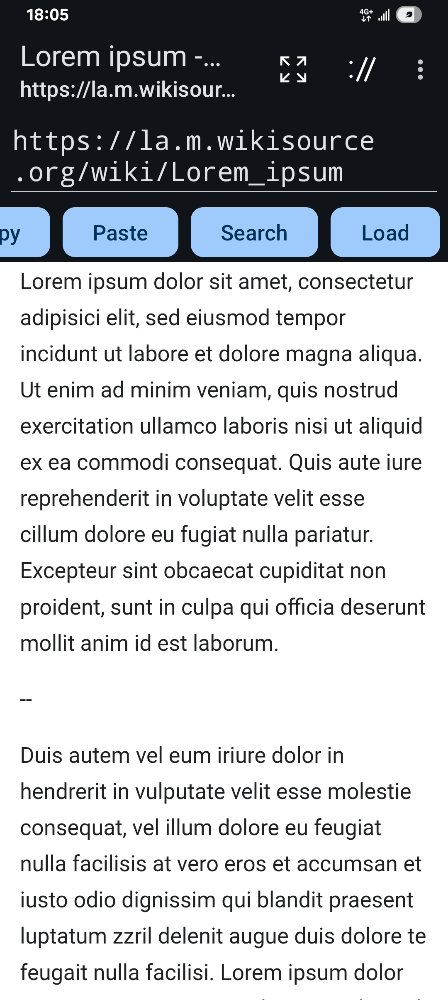

# Fundamental Browser

Fundamental Browser is a basic browser designed for running on Android. It is based on `WebView` and is intended to be developer-friendly.

In addition to browser, it can also be used as a JavaScript interpreter, generalized (and programmable) intent sender and activity launcher. (Since version 0.7.0)

### Screenshots

### Features to be implemented

A developer-friendly browser should: (A checked box means implemented or already supported.)

- [x] Provide a field for editing URL

    - [x] The field itself should be large enough and should allow multiline editing.

    - [x] Can be closed or collapsed, so that the user can focus on the content.

    - [x] Should use a monospace font.

    - [x] The text size should be large enough.

    - [x] The URL should be displayed as-is.

- [ ] Customizable headers

- [x] Support desktop mode (on mobile).

- [x] Selectable or customizable locales (for the content rather than UI)

- [x] Support searching in content.

- [x] Log everything so that nothing is secretly down- or up-loaded.

- [ ] Display cookies.

- [x] Support `view-source:`. (Supported through framework)

- [x] Support `javascript:`. (Supported through framework; the output of `console.log` will be joined with the app's log.)

**The following features are not planned and thus will not be implemented in near future:**

- [ ] Ad-blocking

- [ ] Anti-tracking

- [ ] Bookmarks

### Other features

#### Separated buttons for searching and URL loading

To make the search button usable, the 'Search URL' must be set. The search button is not the same as the 'Go' button, which loads a page of a given URL but will not do search, while the search button will not load a URL but... search for it.

#### Console mode

To enter the console mode, input some code with the `javascript:` prefix in the URL field and press the 'Go' button while the log window is opened, or load it before loading any page or search. You must prefix each command with `javascript:` to keep it in this mode. This can also be used as an interpreter. Remember not to use the 'Search' button, which will not execute any code in the URL field, but will search it.

Alternatively, you can use the (optional) 'Run' button to run the code (enabled in settings), in which case you don't have to (and must not) add the `javascript:` prefix.

Using a command prefixed with `javascript:` in any other situation will cause it to be executed normally, as if loading a URL. The execution of such code, even in the console mode, is never handled by this app, but by the framework or system. This app only implemented the logic to display the log messages.

### Note

* Since this app allows multiline editing, the 'Go' and 'Search' buttons (but not the 'Run' button) will by default replace newline characters in the URL field with spaces, or encode them as `%20` (meaning space). So be careful about your *code* that uses them, if any.

* To keep things simple, new windows are implemented in this app as new tasks/activities. Using more than one window may consume a lot of system resources due to this reason. Hence, new windows are not created automatically in most cases.

* For security concerns, JavaScript is automatically disabled by default when opening a URL from within another application. This can be changed in settings. In addition, this app will not load a URL from an intent unless its scheme is `http:` or `https:` (and currently, only the latter will be successfully loaded). The latter rule is not enforced for URLs from a webpage or for URL/URIs loaded manually by the user.

* Remember to (or not to) update your 'System WebView.' It may affect the behavior of this application.

### Details

* The whole app (except for icons, etc.) is written in Kotlin. No JavaScript used except in examples and tests (for the console).

* JavaScript code, including user-input code, is executed via platform API (for which the underlying system could utilize something called V8, but I'm not sure), so this app can target the latest platform API level (35 as of Feb. 2025) while still enabling users to run code. (Whether it meets Play store's standard is another thing.)

* `intent:` URIs are half-supported. That is to say, these URIs will usually be processed correctly, and the instantiated intent may be launched if approved by the user. However, this app usually doesn't check if it is an `intent:` URI, except when trying to protect itself from intent-based attacks. (See <a href="#References">[1]</a>.) Instead, `intent:` URIs will be treated as if they were URIs of unrecognized schemes (such as `abc://`), for any of which this app will ask if it should launch an intent. Nonetheless, the app will not ask nor try to launch any intent if it detects that the intent would be sent back to the activity itself or to any other component of this application (for which case it might not create a log entry and can show an error message), so as to prevent the security issue mentioned in <a href="#References">[1]</a>. Despite being suggested in <a href="#References">[2]</a>, this app doesn't use `CATEGORY_BROWSABLE` to instantiate such intents, as it would still be insufficient according to <a href="#References">[1]</a> (and this app doesn't use the unsafe constant anyway). This application has its own security-related mechanism as mentioned above; basically, an `intent:` URI is forbidden if it would be sent back to this app; it is otherwise up to the user's explicit intention. If this mechanism is proved to still be insufficient, please open an issue to let me know.

* By using some code that looks like `javascript:location.href="intent:#Intent;...;end"`, you may use this application as a generalized activity launcher and intent sender (by specifying `action`, `component`, etc. in the form of text; remember to use constant values rather than their names). Unlike in <a href="#References">[1]</a>, you don't have to add `SEL` (which should have no effect anyway), as the rules mentioned above still apply: you can't use it to access any activity of this app; for other apps, only exported activities. This usage is still under test.

### Projects that offer similar functionalities

* [Eruda](https://github.com/liriliri/eruda)

* [MobiDevTools](https://sourceforge.net/projects/mobidevtools/)

These are listed purely for comparison. They are not associated with this app nor its author.

### References

1. <https://www.mbsd.jp/Whitepaper/IntentScheme.pdf>

2. <https://developer.android.com/reference/kotlin/android/content/Intent#URI_ALLOW_UNSAFE:kotlin.Int>

### Disclaimer

- **JavaScript** is a trademark or registered trademark of Oracle Corporation.

- **Android** and **Google Play** are trademarks or registered trademarks of Google LLC.
